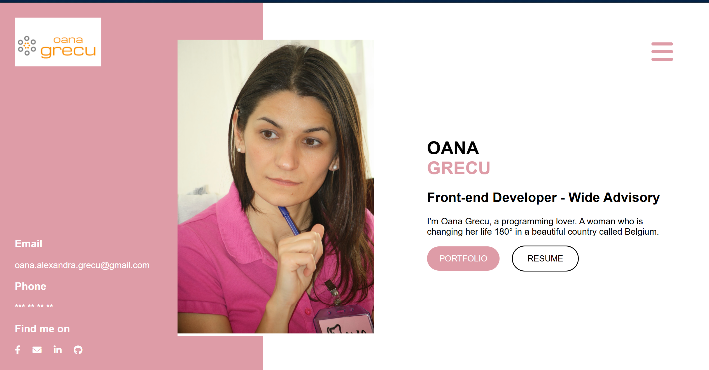

### 👋 Hi there  

I'm Oana Alexandra Grecu, a Web Developer based in Brussels, Belgium.  

🌍 Multilingual and detail-driven Front-End Developer with a strong cybersecurity mindset and hands-on experience building secure, responsive web applications using Node.js, Vue.js, React, Angular, and TypeScript.  
💡 Cisco penetration testing expert with a security-first approach to front-end development. Skilled in Python, HTML5, CSS3 (Sass), JavaScript (ES6+), GitHub, UI/UX, Atlassian tools (Jira and Confluence), Bootstrap, and RESTful APIs — focused on clean, scalable code and secure component architecture.  
🚀 Experienced in refactoring legacy code, collaborating in agile teams, and mentoring junior developers. Passionate about continuous learning, inclusive teamwork, and elevating products through UX excellence and cybersecurity best practices.  

---

### 🪪 Check out my digital business card  
  
Click the image to see it live!

---

### 🌱 Currently learning  
- Angular, Python, and PHP  
- API creation and integration  
- Strengthening full-stack and cybersecurity capabilities  

---

### 💼 Work Experience  
- **Cybersecurity & Networking Training** — Interface3 (05/2025 - present, Brussels, Belgium)  
  Practical experience in system support and cybersecurity fundamentals.  

- **Web Developer** — Walter Clayton (01/2024 - 03/2024, Brussels, Belgium)  
  Developed responsive landing pages and implemented modern UI/UX principles.  

- **Front-End Developer** — BeCode.org (05/2023 - 11/2023, Brussels, Belgium)  
  Built full-stack web applications using Express.js and integrated databases for persistent data storage.  

- **Web Developer** — WIDE ADVISORY SRL (09/2021 - 05/2025, Cluj-Napoca, Romania)  
  Designed user interfaces and ensured cross-browser compatibility.  

---

### 💻 Featured Projects  
- [**CreditProExpert**](https://www.creditproexpert.ro/) — Angular, SCSS, TypeScript, Vercel, Jira  
- [**AkWanza**](https://www.akwanza.com/) — D3.js, Stripe, WordPress, Bootstrap, PHP, WooCommerce, Figma  
- [**Personal Portfolio**](https://oanawebsite.netlify.app) — React, Sass, NPM, JSON  
- [**Dark Kitchen (Team Project)**](https://fergalicious.netlify.app/) — Sass, JSON, GitHub, teamwork  
- [**LokkerRoom** ](https://github.com/oanagrecu/lokkeroomProj.git) Node.js, Express.js, MariaDB, JWT Authentication  
- [**Weather App**](https://oanagrecu.github.io/weatherApp/) — API integration, JavaScript, Fetch, DOM  
- [**Cocktail Finder**](https://cocktail-finder-og.netlify.app/) — API integration, JavaScript, Fetch, DOM  
- [**BeforeSunset-GuestHouse**](https://oanagrecu.github.io/BeforeSunset-GuestHouse/) — HTML5, CSS3, Static Site, GitHub Pages
- [**Personal-V-Card**](https://oanagrecu.github.io/V-Card-responsive/) — HTML5, CSS3, Static Site, GitHub Pages
---

### 💬 Ask me about  
- Front-End Development  
- Transitioning from Teaching to Tech  
- Integrating Security Practices in Front-End  

---

### 📫 How to reach me  
📧 oana.alexandra.grecu@gmail.com  
🔗 [LinkedIn](https://www.linkedin.com/in/oanagrecu)  
💻 [GitHub](https://github.com/oanagrecu)  
🌐 [Personal Portfolio](https://oanawebsite.netlify.app/)  

---

### 🌍 Languages  
English | French | Romanian  

---

### ⚡ Fun Fact  
I love gardening, cooking, and solving crosswords or Sudoku puzzles in my free time.
